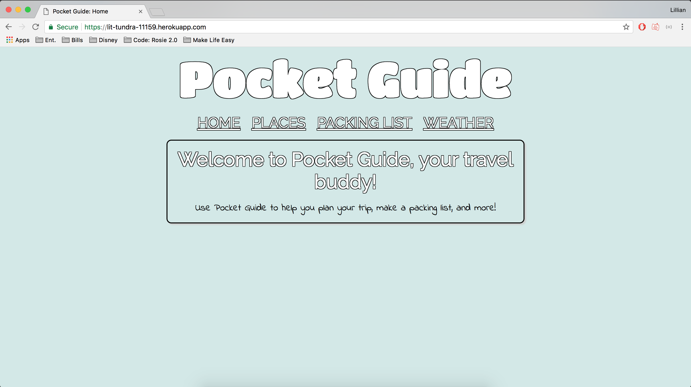
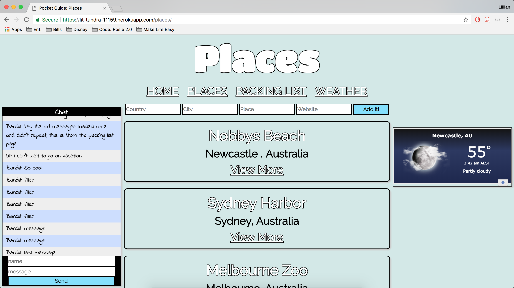
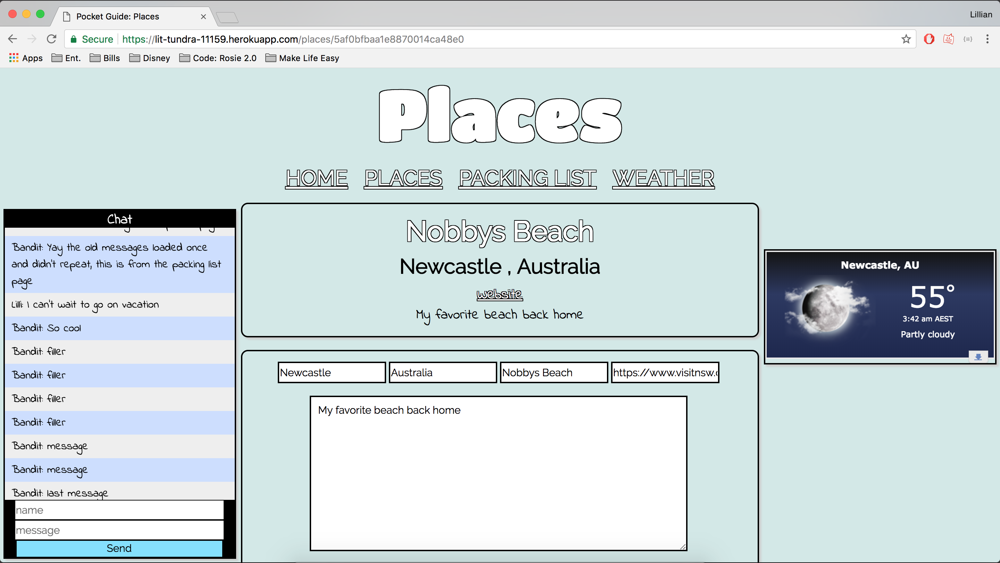
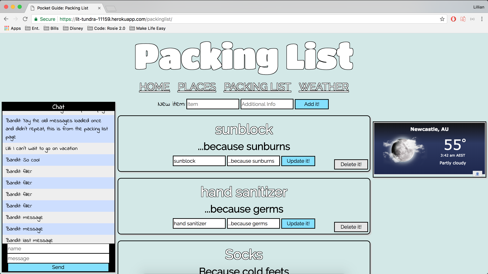
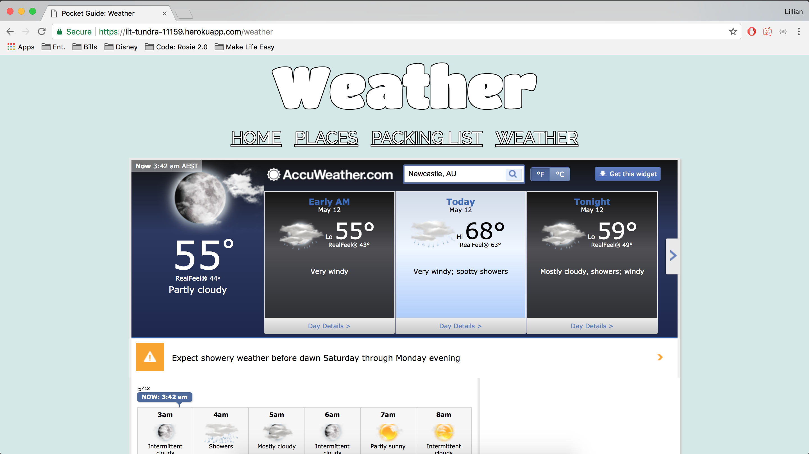

# Project 2 - Full Stack App

## Proposal

### Introduction

**Pocket Guide**

Pocket Guide is a useful application that will help travelers organize where they plan to visit, what they they need, and what to pack. Users will be able to add lists of specific locations that they would like to visit to go sightseeing, dine, explore, etc. They will also be able to create a list of items that they need to pack for their trip. Not only will there be recommendations for the usuals(toiletries, clothes, etc), they will also be able to add if they need to get visas, shots, and other requirements. With the weather page, they'll be able to know what type of clothing to pack.

### Technologies

* JQuery, Mongoose, mLab
* Use previous assignments as a reference, docs, Google, and buddy to help overcome obstacles

### MVP

Users must be able to create, read, and modify a list of places they'd like to visit.

### Goals

* Packing list (2nd database?)
* Weather page (Accuweather widget?)
* Better Styling
* Chat link
  - For people that are traveling with others, so they can be on the webpage and chat at the same time to discuss their trip.

### Stretch Goals
* Functional across platforms (different browsers)
* More user friendly chat app

### Timeline
* **Monday** - Databases and basic layout setup and organized, deployed
* **Tuesday** - Styling & weather widget injected
* **Wednesday** - Chat app for all travelers
* **Thursday** - Research info on multi-platform functionality, implement if there is time

### Wireframe

### Struggles
The most challenging part was figuring out how to store my chat messages and then getting them to load again on each page load. I learned that front end js files will conflict with the backend js files, so I have to use AJAX to get/post things.

### App
* Deployed App: https://lit-tundra-11159.herokuapp.com

### Future Goals

In the future, I'd like to be able to have private sessions. Where each trip has it's own ID, and you need the ID to enter the session. This way there can be multiple trips planned. 
